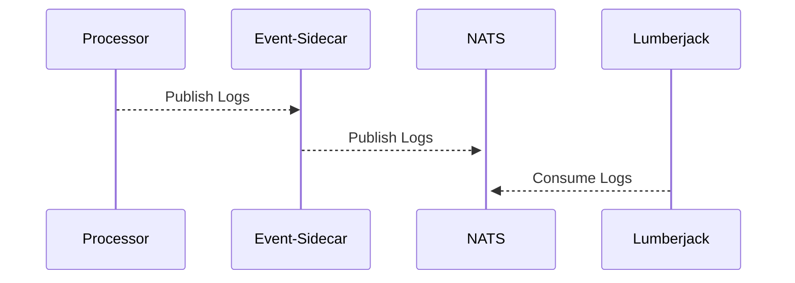

<!-- SPDX-License-Identifier: Apache-2.0 -->

# event-sidecar

This is a gRPC server that is also a NATS publisher. It retrieves logs from the main processor through gRPC and publishes them to Lumberjack through NATS.
The request format consists of a single `LogMessage` format as defined below:

```protobuf
enum LogLevel {
  trace = 0;
  debug = 1;
  info = 2;
  warn = 3;
  error = 4;
  fatal = 5;
}

message LogMessage {
  string message = 1;
  LogLevel level = 2;
  string channel = 3;
  string serviceOperation = 4;
  string id = 5;
}
```

Processors connect to this server and submit requests to it through each log call from the [frms-coe-lib logger servce](https://github.com/tazama-lf/frms-coe-lib/blob/9a82ab9b84c0afa479d0198e1569632d4dc8aabb/src/services/logger.ts#L96)



## Configuration

A sample [.env](.env.example) is provided.

| Variable Name | Purpose | Example |
| --- | --- | --- |
| PORT | Specifies the port number to use | `8080` |
| NATS_SERVER | Specifies the NATS server address | `nats://localhost:4222` |
| NATS_SUBJECT | Defines the NATS subject/topic name | `lumberjack` |

> [!NOTE]
> Adapt the ports as needed in your environment. The `PORT` set in the table above does not need to be `8080` as that may be reserved for something else in different environments.
> [!CAUTION]
> Take note of the `NATS_SERVER` and `NATS_SUBJECT` set in this application's configuration. Lumberjack will need a matching configuration or else logs will not be aggregated in Lumberjack

## Running
```sh
git clone https://github.com/tazama-lf/event-sidecar
cd event-sidecar
npm i
npm run dev
```

### Deployment Notes

This processor is intended to run alongside your Tazama core processors - each processor has its own corresponding event-sidecar next to it

#### Local Development

For local development environments, you can run a **single instance** of this processor (that's exactly what the [Full-Stack-Docker](https://github.com/tazama-lf/Full-Stack-Docker-Tazama) does.

#### Example GRPC client

```typescript
import * as grpc from '@grpc/grpc-js';
import * as protoLoader from '@grpc/proto-loader';
import { type LogMessage } from '@tazama-lf/frms-coe-lib/lib/helpers/proto/lumberjack/LogMessage';
import { type LumberjackClient } from '@tazama-lf/frms-coe-lib/lib/helpers/proto/lumberjack/Lumberjack';
import path from 'node:path';

const PROTO_PATH = path.join(__dirname, '../node_modules/@tazama-lf/frms-coe-lib/lib/helpers/proto/Lumberjack.proto');

const packageDefinition = protoLoader.loadSync(PROTO_PATH, {
  keepCase: true,
  longs: String,
  enums: String,
  defaults: true,
  oneofs: true,
});

const logProto: any = grpc.loadPackageDefinition(packageDefinition).lumberjack;
const client: LumberjackClient = new logProto.Lumberjack('localhost:5000', grpc.credentials.createInsecure());

const object: LogMessage = {
  message: 'foo',
  level: 'error',
  channel: 'tms-service',
};

client.sendLog(object, () => {
  console.log('sent', object);
});
```

## Troubleshooting

For FAQ and troubleshooting, consult: [Troubleshooting](https://github.com/tazama-lf/docs/blob/f3f5cf07425e9785c27531511601fc61a81e51e4/Technical/Logging/Troubleshooting.md)
